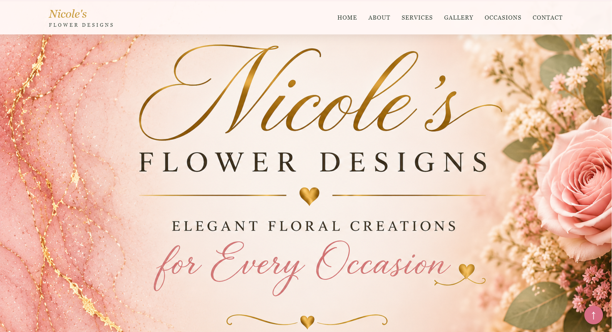
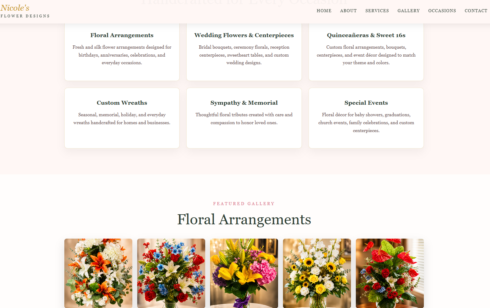
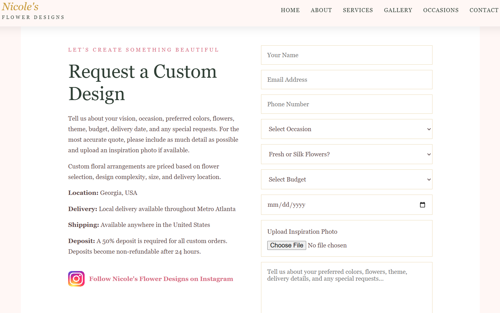

<p align="center">
  
</p>

<h1 align="center">✦ Nicole's Flower Designs ✦</h1>

<p align="center">
<b>Luxury Floral Business Website | Custom Arrangements | Weddings | Events</b>
</p>

<p align="center">
A responsive floral business website created for a family-owned flower design business offering custom arrangements, weddings, quinceañeras, Sweet 16 celebrations, wreaths, sympathy arrangements, local delivery, and nationwide shipping.
</p>

---

## ✦ Live Demo

🌐 **Live Website**

https://angelacoreas1989-boop.github.io/nicole-flower-designs/

---

## ✦ Project Overview

Nicole's Flower Designs is a custom floral business website designed for a family-owned flower business specializing in handcrafted floral arrangements, custom wreaths, weddings, quinceañeras, Sweet 16 celebrations, memorial arrangements, and special events.

The website provides customers with a professional online experience where they can:

* Learn about the business
* View services
* Browse floral galleries
* Submit custom quote requests
* Upload inspiration photos
* Review ordering policies
* Connect through Instagram

---

## ✦ Business Problem

Nicole's Flower Designs relied primarily on social media and word-of-mouth referrals.

Customers needed a centralized location to:

* View floral services
* Browse previous work
* Request custom arrangements
* Upload inspiration photos
* Learn about delivery options
* Review order policies
* Contact the business

Without a dedicated website, customers often needed multiple conversations before receiving pricing information and service details.

---

## ✦ Solution

Developed a responsive floral business website that serves as a professional online storefront.

The website allows customers to:

* Browse floral arrangements and wreaths
* Learn the story behind the business
* Submit detailed quote requests
* Upload inspiration photos
* Review delivery and shipping information
* Understand deposit requirements
* Connect directly through Instagram

The result is a streamlined customer experience and stronger online presence for the business.

---

## ✦ Features

✔ Responsive website design

✔ Luxury floral branding

✔ Custom homepage banner

✔ Meet Norma section

✔ Family legacy story section

✔ Floral arrangement gallery

✔ Custom wreath gallery

✔ Wedding services

✔ Quinceañera services

✔ Sweet 16 services

✔ Special events section

✔ Delivery & shipping information

✔ Deposit policy section

✔ Formspree quote request form

✔ Inspiration photo uploads

✔ Instagram integration

✔ Back-to-top navigation button

✔ Mobile-friendly experience

---

## ✦ Tech Stack

<p align="center">
  
</p>

<p align="center">
HTML • CSS • JavaScript • Git • GitHub • VS Code
</p>

---

## ✦ Website Preview

### Homepage



The homepage introduces visitors to Nicole's Flower Designs with custom branding, luxury floral imagery, and clear navigation to services, galleries, and quote requests.

### Services & Gallery



Customers can explore floral arrangements, wedding florals, quinceañera designs, custom wreaths, and special event creations while learning more about the services offered.

### Custom Quote Request Form



The quote request form allows customers to:

* Select their occasion
* Choose fresh or silk flowers
* Select a budget range
* Upload inspiration photos
* Describe their vision and preferences
* Submit custom quote requests

The form streamlines the inquiry process and helps collect the information needed to provide accurate pricing and design recommendations.

---

## ✦ Services Offered

### Floral Arrangements

Custom fresh and silk floral designs for:

* Birthdays
* Anniversaries
* Graduations
* Housewarmings
* Just Because Gifts

### Weddings

* Bridal Bouquets
* Ceremony Florals
* Reception Centerpieces
* Sweetheart Tables

### Quinceañeras & Sweet 16s

Custom floral arrangements and centerpieces designed around event themes and colors.

### Sympathy & Memorial

Thoughtful floral tributes created with care and compassion.

### Custom Wreaths

Handcrafted wreaths for:

* Everyday Décor
* Holidays
* Memorials
* Seasonal Displays

---

## ✦ Skills Demonstrated

* Responsive Web Design
* Front-End Development
* UI/UX Design
* Mobile Optimization
* Business Requirements Gathering
* Client-Focused Development
* Form Integration
* Formspree Integration
* Image Optimization
* Website Branding
* Content Organization
* GitHub Pages Deployment
* Real-World Business Workflow Design

---

## ✦ What I Learned

This project gave me experience building a website for a real small business with actual customer requirements, branding goals, ordering policies, and service offerings.

I learned how to:

* Gather business requirements
* Design around a client's needs
* Create user-friendly quote request workflows
* Build responsive layouts
* Organize business information effectively
* Integrate forms into a production website
* Develop a polished customer-facing experience

This project strengthened both my technical skills and my ability to translate business needs into functional web solutions.

---

## ✦ Future Enhancements

* Online ordering system
* Digital order agreement
* Customer testimonials
* Seasonal floral catalog
* Event consultation scheduling
* Automated quote responses
* Gift card purchasing
* Customer photo gallery
* Online payment integration
* Downloadable order forms

---

## ✦ Project Structure

```text
nicole-flower-designs/
│
├── index.html
├── style.css
├── script.js
│
├── assets/
│   ├── angela-coreas-banner.png
│   ├── flower-designs-banner.png
│   ├── Homepage.png
│   ├── services-gallery.png
│   ├── Quote-Request-Form.png
│   ├── norma.jpg
│   ├── tko.jpg
│   ├── insta.png
│   ├── Fower-1.png
│   ├── flower-2.png
│   ├── Fower-3.png
│   ├── Fower-4.png
│   ├── Fower-5.png
│   ├── wreath-1.png
│   ├── wreath-2.png
│   └── wreath-3.png
│
└── README.md
```

---
## ✦ CONNECT WITH ME ✦

<p align="center">

<a href="mailto:angelacoreas1989@gmail.com">

</a>

<a href="https://angelacoreas1989-boop.github.io/tech-portfolio/">

</a>

<a href="https://www.linkedin.com/in/angela-coreas">

</a>

<a href="https://github.com/angelacoreas1989-boop">

</a>

</p>

---

## ✦ AUTHOR ✦

<p align="center">
<b>Angela Coreas</b><br>
Software Engineering Student<br>
Transitioning into Tech Through Real-World Projects
</p>

<p align="center">
Building real-world projects while developing skills in software engineering, web development, and modern technology.
</p>

---

<p align="center">
Created for a small business client 🌸
</p>
