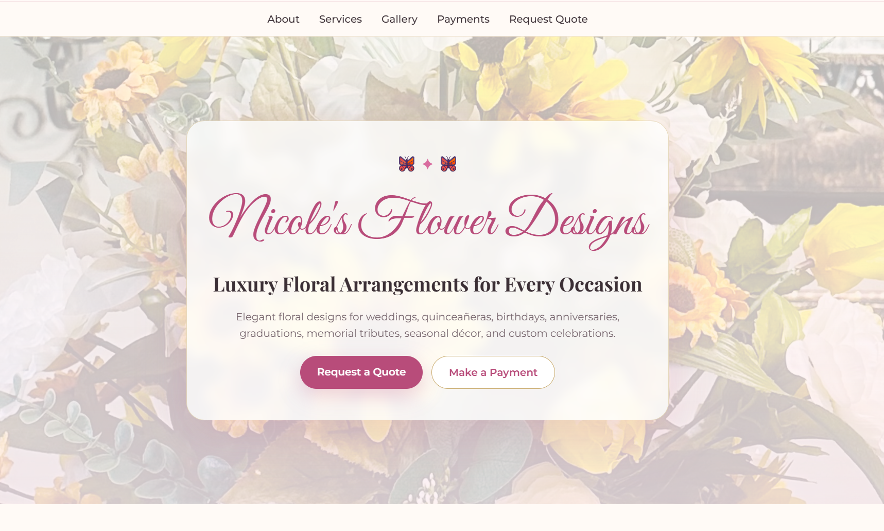

<p align="center">
  
</p>

<h1 align="center">Nicole Flower Designs</h1>

<p align="center">
  ✦ Luxury Floral Design Website ✦
</p>

<p align="center">
  Elegant floral arrangements for weddings, events, celebrations, and special occasions.
</p>

<br>

<p align="center">
  
  
  
</p>

---

## 🌸 About The Project

Nicole Flower Designs is a luxury floral business website designed to showcase elegant floral arrangements for weddings, events, and special occasions.

Built with a focus on modern design, responsive layouts, and user experience, the website provides potential clients with an easy way to explore services, view floral offerings, and submit inquiries.

---

## ✨ Features

* Responsive design
* Luxury floral branding
* Elegant homepage layout
* Services section
* Gallery section
* Contact form integration
* Mobile-friendly experience
* Smooth scrolling navigation
* Professional business presentation

---

## 📸 Project Screenshots

### 🌷 Landing Page

<p align="center">
  
</p>

### 💐 Services & Gallery

<p align="center">
  
</p>

---

## 🛠️ Built With

<p align="left">
  
  
  
  
  
  
</p>

---

## 🚀 Live Demo

🌐 https://angelacoreas1989-boop.github.io/nicole-flower-designs/

---

## 💻 Repository

📂 https://github.com/angelacoreas1989-boop/nicole-flower-designs

---

## 📁 Project Structure

```text
nicole-flower-designs/
│
├── index.html
├── style.css
├── script.js
│
├── photo1.jpg
├── photo2.jpg
├── photo3.jpg
├── photo4.jpg
├── photo5.jpg
│
└── assets/
    ├── angela-coreas-banner.png
    ├── homepage.png
    └── services-gallery.png
```

---

## 🌷 Future Enhancements

* Stripe deposit payments
* Event booking calendar
* Inspiration image uploads
* Automated email confirmations
* Customer gallery experience
* Enhanced animations and transitions

---

## 👩🏽‍💻 Author

**Angela Coreas**

✦ Software Engineering Student | Transitioning into Tech ✦

GitHub: https://github.com/angelacoreas1989-boop

LinkedIn: https://www.linkedin.com/in/angela-coreas-550088186

---

<p align="center">
  ✦
</p>

<p align="center">
  <i>Designed with elegance, creativity, and attention to detail.</i>
</p>

<p align="center">
  ✦
</p>

<p align="center">
  🌸 Created as part of my Software Engineering portfolio journey 🌸
</p>
